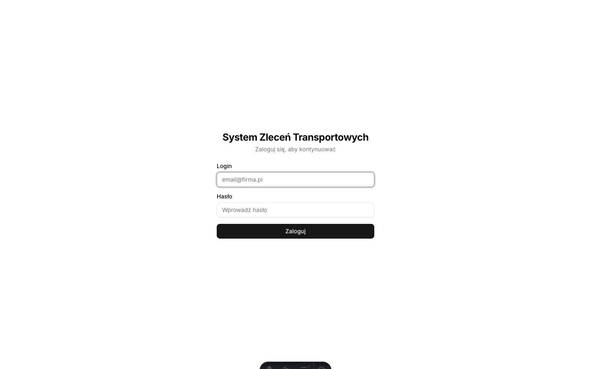
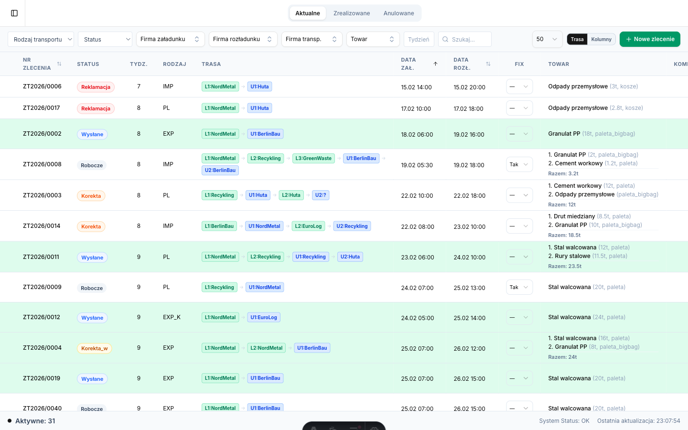
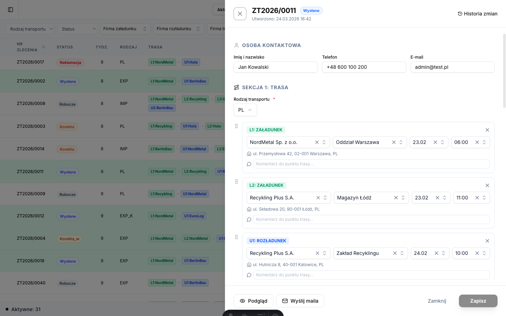
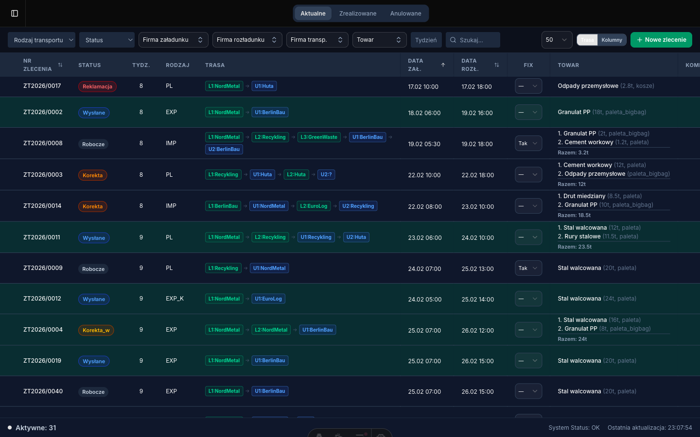

# Planning - System Zleceń Transportowych

Wewnętrzna aplikacja webowa do planowania i wystawiania zleceń transportowych oraz generowania raportów magazynowych.

## Screenshots

| Logowanie | Lista zleceń |
|:-:|:-:|
|  |  |

| Szczegóły zlecenia (drawer) | Dark mode |
|:-:|:-:|
|  |  |

## Stack technologiczny

- **Frontend:** Astro 5.x + React 19 + TypeScript + Tailwind CSS 4 + shadcn/ui (New York)
- **Backend/API:** Astro SSR (Node.js adapter) + TypeScript + Zod (walidacja)
- **Baza danych:** PostgreSQL 15+ (Supabase w środowisku testowym, firmowa infrastruktura w produkcji)
- **Dane słownikowe:** Integracja z firmowym ERP (synchronizacja słowników)
- **Testy jednostkowe:** Vitest + Testing Library
- **Testy E2E:** Playwright (Chromium)
- **Testy obciążeniowe:** k6
- **CI/CD:** GitHub Actions (lint → build → unit tests → E2E)
- **Przeglądarka docelowa:** Chrome (laptopy)

## Wymagania

- Node.js 24+
- npm

## Instalacja

```bash
npm install
```

Skopiuj `.env.example` do `.env` i uzupełnij zmienne środowiskowe (Supabase URL, klucze, CORS origin).

## Skrypty

| Polecenie              | Opis                                        |
| :--------------------- | :------------------------------------------ |
| `npm run dev`          | Uruchamia serwer deweloperski (port 4321)   |
| `npm run build`        | Buduje wersję produkcyjną do `./dist/`      |
| `npm run preview`      | Podgląd wersji produkcyjnej                 |
| `npm run test`         | Uruchamia testy jednostkowe (Vitest)        |
| `npm run test:watch`   | Testy jednostkowe w trybie watch            |
| `npm run lint`         | Sprawdza kod (ESLint)                       |
| `npm run lint:fix`     | Naprawia błędy ESLint                       |
| `npm run format`       | Formatuje kod (Prettier)                    |
| `npm run format:check` | Sprawdza formatowanie                       |
| `npm run e2e`          | Uruchamia testy E2E (Playwright)            |
| `npm run e2e:ui`       | Testy E2E z interfejsem graficznym          |
| `npm run e2e:headed`   | Testy E2E w trybie headed                   |
| `npm run e2e:debug`    | Testy E2E w trybie debug                    |
| `npm run e2e:report`   | Wyświetla raport z testów E2E               |
| `npm run test:load`    | Uruchamia testy obciążeniowe (k6)           |

## Struktura projektu

```
/
├── public/                  # Pliki statyczne
├── src/
│   ├── assets/              # Zasoby (obrazy, ikony)
│   ├── components/
│   │   ├── auth/            # Logowanie (LoginCard)
│   │   ├── orders/          # Moduł zleceń (~24 komponenty)
│   │   │   ├── drawer/      # Panel szczegółów zlecenia
│   │   │   └── history/     # Historia zmian (timeline)
│   │   ├── warehouse/       # Moduł magazynowy (~15 komponentów)
│   │   ├── providers/       # AppProviders (wspólne drzewo providerów)
│   │   └── ui/              # Komponenty shadcn/ui (~24 komponenty)
│   ├── contexts/            # React Contexts (Auth, Dictionary)
│   ├── db/                  # Klient Supabase, typy DB
│   ├── hooks/               # Custom hooks (useOrders, useOrderDetail, useOrderHistory)
│   ├── layouts/             # Layouty stron (Astro)
│   ├── lib/
│   │   ├── services/        # Serwisy backendowe (auth, order, lock, history, eml, pdf)
│   │   ├── validators/      # Schematy walidacji Zod
│   │   └── ...              # api-client, view-models, utils
│   ├── pages/
│   │   ├── api/v1/          # REST API (orders, warehouse, auth, dictionaries)
│   │   ├── index.astro      # Strona logowania
│   │   ├── orders.astro     # Widok zleceń (React island)
│   │   └── warehouse.astro  # Widok magazynowy (React island)
│   ├── styles/              # Style globalne (Tailwind CSS)
│   └── types/               # Typy współdzielone (common, dictionary, order, warehouse)
├── e2e/                     # Testy E2E Playwright
│   ├── tests/               # Pliki spec
│   ├── page-objects/        # Page Objects
│   ├── fixtures/            # Fixtures (rozszerzone test.extend)
│   ├── helpers/             # Test data, helpers
│   └── global-setup.ts      # Autentykacja API
├── tests/load/              # Testy obciążeniowe k6
├── supabase/migrations/     # Migracje SQL
├── docs/screenshots/        # Screenshoty aplikacji (README)
├── .ai/                     # Dokumentacja projektu
├── .claude/                 # Konfiguracja agentów AI
├── .github/workflows/       # CI/CD (GitHub Actions)
├── astro.config.mjs         # Konfiguracja Astro
├── playwright.config.ts     # Konfiguracja Playwright
├── eslint.config.js         # Konfiguracja ESLint
├── tsconfig.json            # Konfiguracja TypeScript
└── package.json
```

## API

REST API dostępne pod `/api/v1/`:

### Zlecenia

| Endpoint                              | Opis                                    |
| :------------------------------------ | :-------------------------------------- |
| `GET /orders`                         | Lista zleceń (filtrowanie, paginacja)   |
| `POST /orders`                        | Tworzenie nowego zlecenia               |
| `GET /orders/:id`                     | Szczegóły zlecenia                      |
| `PUT /orders/:id`                     | Aktualizacja zlecenia                   |
| `POST /orders/:id/lock`              | Blokada zlecenia do edycji              |
| `DELETE /orders/:id/lock`            | Odblokowanie zlecenia                   |
| `PUT /orders/:id/status`             | Zmiana statusu                          |
| `POST /orders/:id/duplicate`         | Duplikowanie zlecenia                   |
| `POST /orders/:id/restore`           | Przywracanie zlecenia                   |
| `POST /orders/:id/prepare-email`     | Pobranie pliku .eml z załącznikiem PDF  |
| `GET /orders/:id/pdf`                | Pobranie PDF zlecenia                   |
| `GET /orders/:id/history/changes`    | Historia zmian                          |
| `GET /orders/:id/history/status`     | Historia statusów                       |
| `PUT /orders/:id/stops`             | Aktualizacja przystanków trasy          |
| `PUT /orders/:id/carrier-color`     | Zmiana koloru przewoźnika               |
| `PUT /orders/:id/entry-fixed`       | Oznaczenie wpisu jako ustalonego        |

### Magazyn

| Endpoint                                    | Opis                           |
| :------------------------------------------ | :----------------------------- |
| `GET /warehouse/orders`                     | Lista zleceń magazynowych      |
| `GET /warehouse/report/pdf`                | Pobranie raportu PDF           |
| `POST /warehouse/report/send-email`        | Wysłanie raportu emailem       |
| `GET /warehouse/report/recipients`         | Lista odbiorców raportu        |

### Autentykacja i słowniki

| Endpoint                              | Opis                           |
| :------------------------------------ | :----------------------------- |
| `POST /auth/me`                       | Autentykacja użytkownika       |
| `GET /companies`                      | Słownik firm                   |
| `GET /locations`                      | Słownik lokalizacji            |
| `GET /products`                       | Słownik produktów              |
| `GET /transport-types`                | Typy transportu                |
| `GET /order-statuses`                 | Statusy zleceń                 |
| `GET /vehicle-variants`               | Warianty pojazdów              |

### Administracja

| Endpoint                              | Opis                           |
| :------------------------------------ | :----------------------------- |
| `POST /dictionary-sync/run`          | Synchronizacja słowników z ERP |
| `GET /dictionary-sync/jobs/:jobId`   | Status zadania synchronizacji  |
| `POST /admin/cleanup`               | Czyszczenie danych             |
| `GET /health`                         | Health check                   |

## Role użytkowników

| Rola        | Uprawnienia                                      |
| :---------- | :----------------------------------------------- |
| `ADMIN`     | Pełny dostęp + zarządzanie użytkownikami         |
| `PLANNER`   | Tworzenie, edycja, zmiana statusu zleceń         |
| `READ_ONLY` | Tylko podgląd listy i szczegółów zleceń          |

## Narzędzia AI

- **Claude Code (CLI)** — główne narzędzie do pisania kodu, refactoringu, debuggingu
- **Multi-agent workflow** — 7 wyspecjalizowanych agentów AI (Frontend, Backend, Database, Types, Tester, Reviewer, Coordinator) uruchamianych równolegle do eksploracji kodu, planowania architektury i code review. Orkiestrator deleguje zadania wg domeny plików, agenci pracują w izolowanych worktree i raportują wyniki. Definicje: `.claude/agents/`, pamięć: `.claude/agent-memory/`

## Dokumentacja

Szczegółowa dokumentacja projektu znajduje się w katalogu `.ai/`:

- `prd.md` - Product Requirements Document
- `db-plan.md` - Schemat bazy danych (tabele, relacje, indeksy, RLS)
- `api-plan.md` - Specyfikacja API
- `ui-plan.md` - Plan interfejsu użytkownika
- `orders-view-implementation-plan.md` - Plan implementacji widoku zleceń
- `to_do/to_do.md` - Lista zadań do realizacji
- `rules/tech-stack.md` - Opis stacku technologicznego
- `rules/` - Reguły i konwencje dla kodowania, testów, komponentów UI
